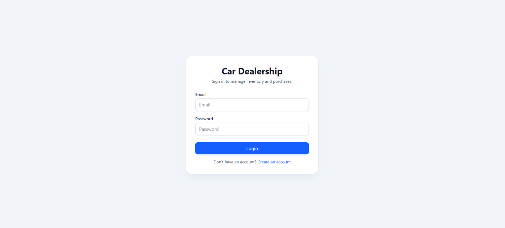
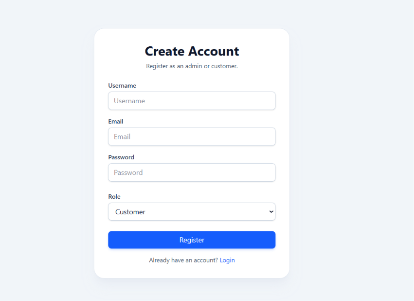
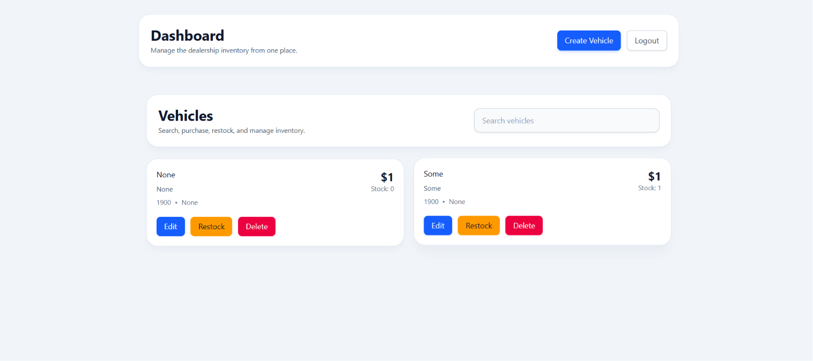
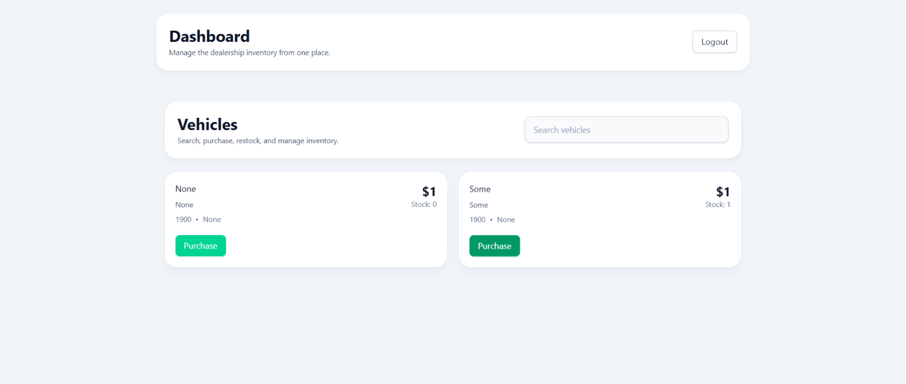

# Car Dealership Inventory System

Car Dealership Inventory System is a full-stack web app for managing vehicle inventory, authentication, and role-based access.

The backend is a FastAPI service that exposes authentication and vehicle management APIs. The frontend is a React + Vite application that provides login, registration, dashboard, inventory, purchase, and admin workflows.

## Features

- JWT-based login and registration
- Role-based access for `admin` and `customer`
- Vehicle listing, details, editing, purchase, and restock flows
- Protected routes for authenticated users
- Admin-only actions for inventory management
- Responsive UI with loading and alert states

## Project Structure

- `backend/` - FastAPI application, SQLAlchemy models, repositories, and tests
- `frontend/` - React application, UI components, API clients, and Vitest tests

## Local Setup

### Prerequisites

- Python 3.13+
- Node.js 20+
- npm

### 1. Clone the repository

```bash
git clone <repo-url>
cd car-dealership
```

### 2. Configure the backend

Create a `backend/.env` file with a secret key:

```env
SECRET_KEY=replace-with-a-secure-dev-secret
```

Install backend dependencies from the repository root using the shared virtual environment or your preferred Python environment:

```bash
pip install -r requirements.txt
```

Run the backend API from the `backend/` folder:

```bash
uvicorn app.main:app --reload
```

The backend runs at `http://localhost:8000` and exposes APIs under `http://localhost:8000/api/v1`.

### 3. Configure the frontend

Install frontend dependencies:

```bash
cd frontend
npm install
```

Run the frontend development server:

```bash
npm run dev
```

The frontend runs at `http://localhost:5173` and is configured to talk to the backend on `http://localhost:8000/api/v1`.

## Running Tests

### Backend

From `backend/`:

```bash
..\venv\Scripts\python.exe -m pytest
```

If your virtual environment is already activated, `pytest` is enough.

### Frontend

From `frontend/`:

```bash
npm test
```

## Screenshots

Add final application screenshots here. Suggested placeholders:

- Login screen: 
- Register screen with role selector: 
- Admin Dashboard: 
- Customer Dashboard: 

## Test Report

| Suite | Command | Result |
| --- | --- | --- |
| Backend | `..\\venv\\Scripts\\python.exe -m pytest` | 24 passed, 4 warnings |
| Frontend | `npm test` | 13 files passed, 34 tests passed |

Notes:

- Backend warnings are deprecation warnings from FastAPI/Starlette and Pydantic, not failures.
- Frontend tests pass cleanly.

## My AI Usage

I used AI assistance to:

- Draft and organize the project documentation.
- Reconstruct a practical setup guide for both backend and frontend.
- Summarize verified test outcomes into a readable report.
- Prepare a prompt log that reflects the work completed in this workspace session.

I verified the generated documentation against the actual project structure, backend configuration, and test results before finalizing it.
